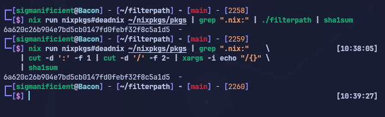

# filterpath

A small utility that retrieve a valid path from a messy piped line  


## Example

Without `filterpath`

```
$ find . -maxdepth 2 | head -n 10 | xargs -i echo "?demo[{}.text<<:" 
?demo[..text<<:
?demo[./filterpath.h.text<<:
?demo[./.editorconfig.text<<:
?demo[./tokei.toml.text<<:
?demo[./filterpath.c.text<<:
?demo[./flake.nix.text<<:
?demo[./.git.text<<:
?demo[./.git/logs.text<<:
?demo[./.git/REBASE_HEAD.text<<:
?demo[./.git/description.text<<:
```

Using `filterpath`

```
$ find . -maxdepth 2 | head -n 10 | xargs -i echo "?demo[{}.text<<:" | ./filterpath
./filterpath.h
./.editorconfig
./tokei.toml
./filterpath.c
./flake.nix
./.git
./.git/logs
./.git/REBASE_HEAD
./.git/description
```

> [!NOTE] `filterpath` did not find the frist `.text`.
> This can happen as this program tries to stay relatively fast by avoiding
> testing all combinations.

## Real world example

Lets try to find all files on `nixpkgs` where deadnix report a problem.

```
$ nix run nixpkgs#deadnix pkgs
Warning: Unused declarations were found.
   ╭─[/home/sigmanificient/nixpkgs/pkgs/shells/oksh/default.nix:4:3]
 4 │, buildPackages
   │        ╰─────── Unused lambda pattern: buildPackages
Warning: Unused declarations were found.
   ╭─[/home/sigmanificient/nixpkgs/pkgs/shells/fish/plugins/build-fish-plugin.nix:1:11]
 1 │{ stdenv, lib, writeScript, wrapFish }:
   │           ╰── Unused lambda pattern: lib
 6 │  src,
   │   ╰── Unused lambda pattern: src
...
```

We can quickly apply a `grep` to filter down to the file paths:

```
$ nix run nixpkgs#deadnix ~/nixpkgs/pkgs | grep ".nix:"
   ╭─[./pkgs/shells/oksh/default.nix:4:3]
   ╭─[./pkgs/shells/fish/plugins/build-fish-plugin.nix:1:11]
   ╭─[./pkgs/shells/fish/default.nix:4:3]
    ╭─[./pkgs/shells/zsh/zsh-powerlevel10k/default.nix:13:41]
   ╭─[./pkgs/shells/bash/bash-completion/default.nix:2:3]
   ╭─[./pkgs/build-support/fetchnextcloudapp/default.nix:1:3]
   ╭─[./pkgs/build-support/flutter/default.nix:1:3]
     ╭─[./pkgs/build-support/coq/extra-lib.nix:111:13]
    ╭─[./pkgs/build-support/coq/default.nix:56:23]
    ╭─[./pkgs/build-support/coq/meta-fetch/default.nix:1:8]
...
```

However, a new problem is becoming evident: retrieve the filepath from these
lines.

With some trial and error, it is possible to come with an command what would
properly cut all the paths properly, but it is not trivial.
Here is one i found after tinkering a bit:

```
$ nix run nixpkgs#deadnix ~/nixpkgs/pkgs | grep ".nix:" \
    | cut -d ':' -f 1  \
    | cut -d '/' -f 2- \
    | xargs -i echo "/{}"
```

### with `filterpath`

Skipping the last part, let's pipe to `filterpath` directy:

```
$ nix run nixpkgs#deadnix nixpkgs/pkgs | grep ".nix:" | ./filterpath
./pkgs/shells/oksh/default.nix
./pkgs/shells/fish/plugins/build-fish-plugin.nix
./pkgs/shells/fish/default.nix
./pkgs/shells/zsh/zsh-powerlevel10k/default.nix
./pkgs/shells/bash/bash-completion/default.nix
./pkgs/build-support/fetchnextcloudapp/default.nix
./pkgs/build-support/flutter/default.nix
./pkgs/build-support/coq/extra-lib.nix
./pkgs/build-support/coq/default.nix
./pkgs/build-support/coq/meta-fetch/default.nix
...
```

#### Testing `sha1sum`


